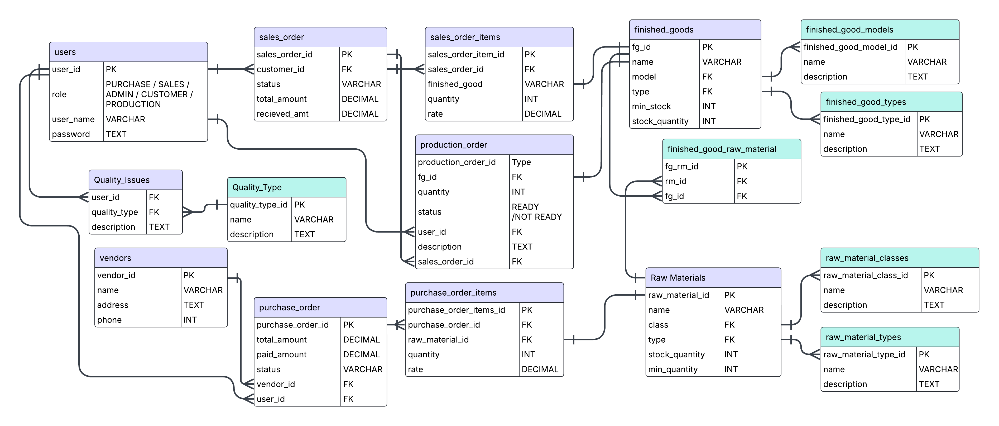

# MagneqBackend

The **MagneqBackend** is a powerful and modular Node.js backend built with Express, MongoDB, and Docker. It supports comprehensive API routes, Swagger documentation, and mock data seeding to accelerate development and testing.

---

## 📊 ER Diagram (SQL VERSION)



--

## ⚙️ Requirements

- **Node.js**: `v22.4.1`
- **npm**
- **Docker Desktop**

---

## 🚀 Getting Started

Follow these steps to set up and run the backend locally:

### 1. Clone the Repository

```bash
git clone https://github.com/your-username/MagneqBackend.git
```

### 2. Navigate into the Project Directory

```bash
cd MagneqBackend
```

### 3. Install Dependencies

```bash
npm install
```

### 4. Configure Environment Variables

Rename the sample environment file:

```bash
mv sample.env .env
```

> 🛠️ Make sure to update the `.env` file with your environment-specific variables.

### 5. Start Docker Containers

Make sure Docker Desktop is running, then start the services:

```bash
docker compose up
```

> ⚠️ If this command doesn't work, **open Docker Desktop** to ensure the Docker daemon is active.

### 6. Seed the Database with Mock Data

Open a **new terminal** in the project root and run:

```bash
npm run seed
```

### 7. Install Nodemon Globally (if not already installed)

```bash
npm install -g nodemon
```

### 8. Start the Development Server

```bash
npm run dev
```

### 9. Access API Documentation

Once the server is running, open your browser and visit:

```
http://localhost:5000/api-docs#/
```

Explore and test all available endpoints via the Swagger UI.

---

## 🧪 Tech Stack

- **Node.js** `v22.4.1`
- **Express.js**
- **MongoDB (via Docker)**
- **Mongoose**
- **Swagger for API documentation**
- **Docker & Docker Compose**

---

## 📝 License

This project is licensed under the MIT License.

---

> 💬 For any issues or contributions, feel free to open an issue or pull request.
